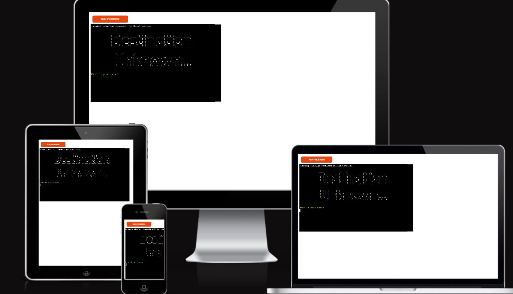
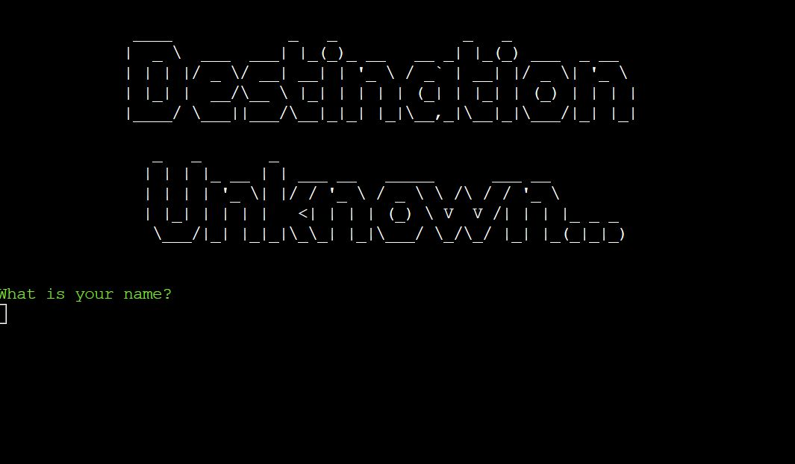
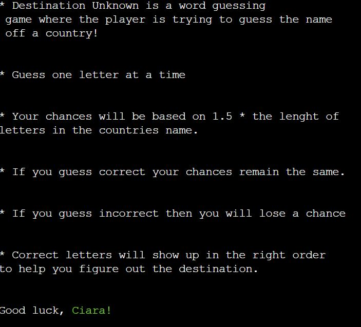
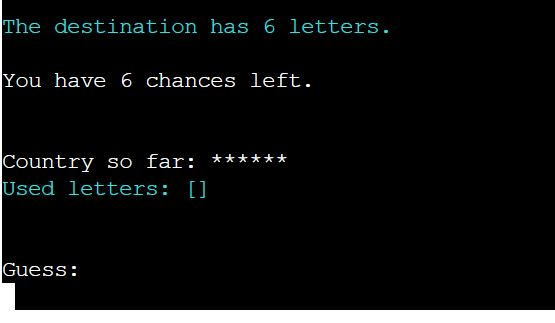
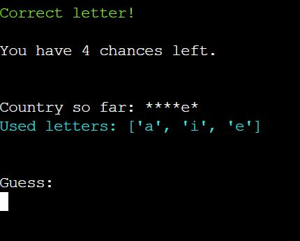
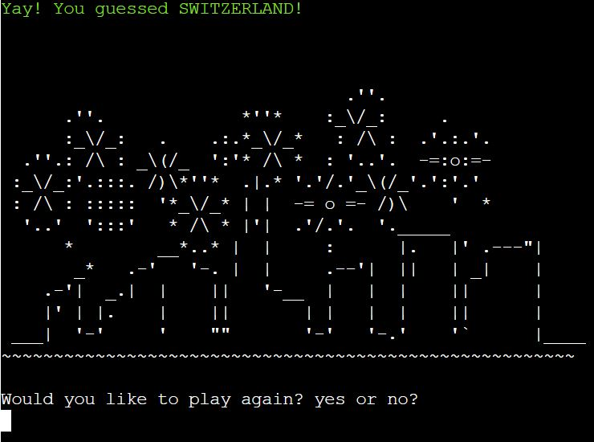
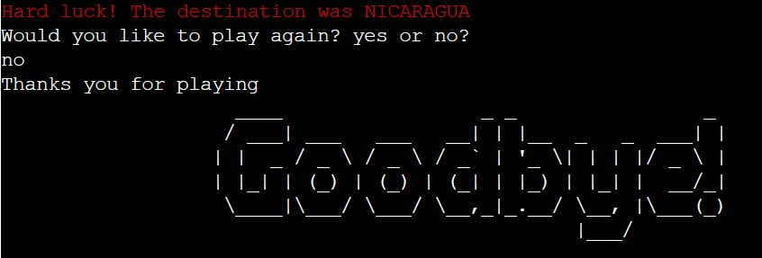
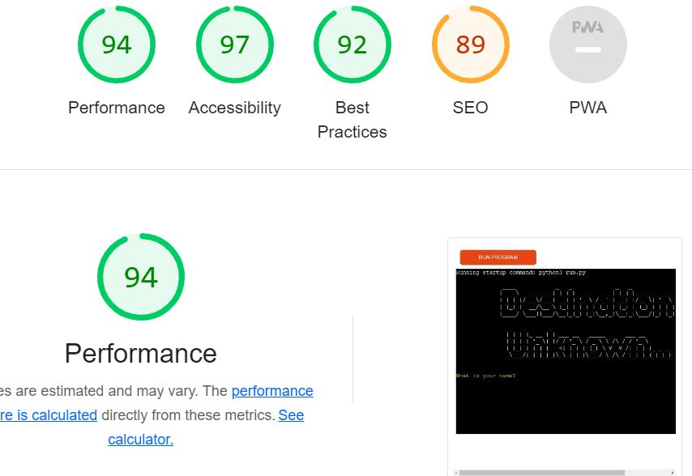
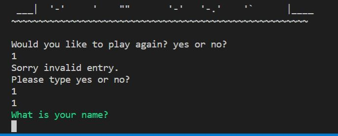
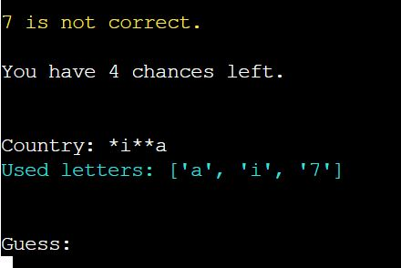

# [Destination Unknown...](https://destinationunknown1.herokuapp.com/)

Destination Unknown is a simple word guessing game that I created where the word guessed by the player is a country from around the world. The name is a play on the popular song Destination Unknown by Alex Gaudino which I unknowingly kept singing while I was working on this game. Sorry if it is now in your head also!

The game follows the same logic as most guessing word games. The user is told how many chances they have, calculated to be 1.5 times the length of the word. Every time they get a letter right it will show up in the word e.g. the user guesses 'a' this then reveals it was a correct guess and shows the word as *a*a*a. If the user guesses wrong then their chances decrease. A list of already guessed letters is shown to the user so that they can try and figure out the destination before they run out of lives. 

It is a fun game to play for all ages and is suprisingly hard at times. It had me learning alot about countries I had never known existed after playing. I really enjoyed making it as my first go at a python based project. 

## How to play
1. The player will be asked to enter their name. 
2. Once they enter a valid name (letters only) the user will be told how many chances they have and how long the country they are looking for is. 
3. The user is asked to submit a guess, the app takes one letter at a time and then they are told if it correct or incorrect. 
4. If the guess is correct the user's chances stay the same. If it is incorrect their chances decrease. 
5. If the player's guess is correct then the next time the country will show with the correct letters in the right place so that the user can start to whittle down their guesses. 
6. If the user guesses the country before they run out of chances then they will be congratulated and asked if they would like to play again.
7. If the player runs out of chances then they loose and are told what the country was and asked if they would like to play again. 
8. If the answer is yes, the game restarts. If the answer is no, then the game ends. 

## Site Owner Goals
- To create an app that would be simple and easy to use for anyone 8+
- To give the user clear instructions on how to play 
- To provide a clean and logical interface that would have players return to play again
- For the user to have fun and share it with friends

## User Stories
* As a user I want to:
 - Understand how the game works
 - Easily play along with the game with little to no difficulty
 - See how many turns I have left
 - Guess the correct country
 - Play again if I wish to do so

## Logic Flow
In order for me to work through the logic of how the game would work and what python code I would need to write I created a flow chart using Lucid Chart. It was very beneficial for me to have a flow chart while working on this game as it kept me focused on the task at hand and allow me to build out the basic code to create this site. As new student of python I found this helped me greatly to get a grasp of the task at hand and to break it down into simple code I could write myself.

## Design Choices 

When creating this game I decided to use some colored fonts to help with the user experience. As the game is called Destination Unknown, I decided to use colors that are found on the globe, green and blue and I also added some yellow and red too for the user to differentiate the outcomes. 

I had written the functions so that only uppercase letters could be entered but as a user I found this frustrating so I removed it so that it would accept either lower or upper case and I found it made the game more enjoyable. 

I sped up the time sleep function as the more I played the game the less I, as a user, wanted to play. 

I also increased the amount of chances the user gets from 1.2 * the length of the destination to 1.5* as some of the countries are really tricky. I found as a user I wanted to have a few more guesses. 

## Features
#### Title
I created the title by importing pyfiglet in my run.py. I chose this as I liked the old school look and feel to the to graphics. I feel it suits the look and feel of the terminal

#### Welcome Message

The user is asked to submit their name and given a description of the game so that they know how to play the game. 

#### Destination information

The user will be told how many letter are in the destination word and told how many chances they have to guess the correct destination. 

#### Timed next steps

Once the user begins guessing the letters that could be in the the destination they will be told
if their guess is correct or not. For each guess the screen will clear and tell the user how many goes they have left. The information will appear with .5 second delay. I have used different colored fonts to head with readability for the user and to help keep them engaged. 

#### You Win

If the user guesses the destination, they will get a message and then be asked if they woudl like to play again.

#### You Lose

If the user runs out of chances they will lose. They will be told the correct destination and asked if they would like to play again

#### Play Again

If the user choses to play again they will be brought back to the start.

#### Player chooses not to play again
If the player chooses not to play again then they are thanked and receive a goodbye graphic using pyfiglet.
 

## Future Features
As this is my first experience with python I kept this app extremely simple so there is many features I would like to implement in the future as I was build on my knowledge. I was also time shy so I stuck to the basics. I feel alot of these functions would be within my capabilities if I had a little more time but this is down to life and work getting busy for this module. I did however really enjoy learning python and look forward to implementing these in the future. 

- I would like to implement different levels of difficulty.
- I would like to create an option of choosing either a capital city or country for the user to change up the game while they play. 
- I would like to add some more graphics and develop the ux design to make it more appealing.
- As my skills with python develop I am sure that this app's code could be written much neater and more concise. Once I finish this course I look forward to reviewing it. Hopefully with a much better eye. 
- Add the function to only choose letters as currently numbers are also accepted. Sadly due to time constraints I realized this too late. 
- Add to the function to only be able to choose a letter once and produce a value error

## Technologies Used
I have used several technologies that have enabled this design to work:

- [random](https://docs.python.org/3/library/random.html?highlight=random#module-random) - `random.choice` is used to select a random word for the game from words.py.
- os.system` is used to clear the terminal after each guess.  
- [pyfiglet](https://pypi.org/project/pyfiglet/0.7/) - for taking ASCII text and rendering it into ASCII art fonts.
- [colorama](https://pypi.org/project/colorama/) - for adding colour to terminal text.
- [GitHub](https://github.com/) - used for version control.
- [Heroku](https://dashboard.heroku.com/apps) -  used to deploy the live project.
- [Lucidchart](https://lucid.app/documents#/dashboard) -  used to create my flowchart.
- [PEP8 Online](http://pep8online.com/) - used to validate all the code.
- [Grammerly](https://app.grammarly.com/) - used to proof read the README.md.

## Testing
#### User Stories 
 Expectations
      As a user I wanted to:
      1. To be able to run the program
      2. Input my user name
      3. Be presented in information on how the game works
      4. Know how many chances I get to guess the destination
      5. Enter my guess
      6. See my progression
      7. Find out the correct destination either by guessing or losing 
      8. Have an option to play again
Results
      As a user I was able to:
      1. Run the program
      2. Input my user name
      3. Read information about how the game works and know how to play
      4. Enter my guesses one at a time
      5. See how many chances I have left
      6. Try to figure out the correct destination via the correct letters I have guessed
      7. Play again if I wish to do so

#### Manual Testing
Throughout working on the project I used the terminal while I was building the functions. I used a practice repository to figure out the flow and functions and then built out that

| Feature           |  Expect              |  Action |  Result                 |
|-------------------|----------------------|---------|-------------------------|
|Input Name         |To enter my name      |Type  |Terminal prints back my name|
|Enter a guess      |To be able to type a letter|Type |I can enter a letter |
|Know how many chances I have|To be told I have X chances |N/A |I know how many chances I have  |
|Know if a guess is correct or incorrect|To see right/wrong letters|N/A |I know what letters are right/wrong|
|Be told the outcome |Know if I win/lose   |N/A |I find out if I win/lose|
|Play again     |An option to play again |Type |I can choose to play again or exit the game |

- I had many good friends test the app for me on both laptop and desktops and I got some nice feed back on it being a fun game to play.
- I did test on mobile and it can be played but there seems to be a bug where by it repeats the user name and guesses at ever guess. The game can still be played it's just not a great user experience.

#### Validator Testing

I tested my code on PEP8 and initially had quite a few errors. Nothing major just trailing white space, expected two blank lines, lines too long etc. I was able to fix all of this without too much hassle and it was a great learning experience to help me gain practice in what is expected of python. All errors were clear at the time of final deployment.

I also tested the site on Lighthouse with good results.

## Bugs
#### Fixed Bugs
Whilst building this app I can across many bugs which were a mixture of inexperience, typos and trial and error however I was able to fix the majority. 

I ran into issues with my play_again function but was able to solve this by changing the variable name inside the function and then I was able to call the function when the user entered an invalid option. 

#### Unfixed Bugs
As mentioned previously due to time constraints, I did not get a chance to add the option of only choosing a letter for the user guesses they can enter a number and will lose a chance. I do reiterate throughout the game to please enter a letter. I am sure it is likely a quick fix but on my 11th hour attempt I broke the code so reverted back and hope to fix it in the future as I am confident I can do it.

There are many things that I wish I could have implemented and I hope i have tested the app enough so that the user can have a pleasant user experience. I also am aware that there is likely 10 better ways I could have wrote the code but I did enjoy the trial and error of figuring it out. 

## Deployment

This code was connected to Heroku via GitHub  using the following steps:
1. I created the repository from the Code Institute Python template.

## Clone Project ##

The site was deployed via [Heroku](https://dashboard.heroku.com/apps), and the live link can be found here: [Destination Unknown](https://destinationunknown1.herokuapp.com/)

Before deploying to Heroku pip3 freeze > requirements.txt was used to add all the dependencies required to the requirements.txt file. This is required for the game to run on Heroku.

The following steps were then taken:
1. Log in to [Heroku](https://dashboard.heroku.com/apps) or create an account.
2. On the main page click the button labelled New in the top right corner and from the drop-down menu select "Create New App".
3. Enter a unique and meaningful app name.
4. Next select your region.
5. Click on the Create App button.
6. Click on the Settings Tab and scroll down to Config Vars.
7. Click Reveal Config Vars and enter PORT into the Key box and 8000 into the Value box and click the Add button.
8. Next, scroll down to the Buildpack section click Add Buildpack select python and click Save Changes
9. Repeat step 11 to add node.js. Note: The Buildpacks must be in the correct order. If not click and drag them to move into the correct order.
10. Scroll to the top of the page and choose the Deploy tab.
11. Select Github as the deployment method.
12. Confirm you want to connect to GitHub.
13. Search for the repository name and click the connect button.
14. Scroll to the bottom of the deploy page and either click Enable Automatic Deploys for automatic deploys or Deploy Branch to deploy manually. I chose to deploy automatically as heroku is a new
platform for me so I wanted to make sure my final code was deployed. 
15. Click View to view the deployed site.

The site is now live and operational.

## Credits

- #### Copy
The basic copy included in this site was written by the designer. 

- #### Design
Design was inspired from the traditional colors of a globe. 

- #### Online learning resources
Stackoverflow, YouTube, blogs, and tutorials. I have used the following tutorials as inspiration to create this app [Hangman Tutorial](https://www.youtube.com/watch?v=cJJTnI22IF8&t=145s), [ Wordle Tutorial](https://www.youtube.com/watch?v=J6h7D2iQmBU). There were many more online resources that I used throughout building this app and each one expanded basic knowledge of python. 

- #### README.md
I learned alot about how to approach my README file from past projects of Code Institute student which helped me navigate this huge learning curve. Kudos to those who have shared past projects. 

- #### Slack
Code Institute's slack channel was a huge help in helping with problems and to give a sense of what was expected for projects. Support from fellow students was greatly appreciated.

- #### Mentor
My mentor Guido Cecilio is always extrememly generous with his time. Unfortunatley due to my own work and travel schedule I was unable to coordinate with him for this project but I really look forward to discussing it with him. I am sure his advice would have been invaluable for this project but either way I will debrief with him and look forward to his insights.  

- #### Cohort Facilitators
Code Institutes Facilitators were great throughout the project, answering questions and encouraging us to the finish line. They also made it easy to stay on track and keep everyone up to date. Thanks Kenan Wright and Kascia Bogucka.

- #### Cohort Students
Big thanks to my cohort for the positivity and encouragement in the slack group. A very grateful credit to Laura Mayock who gave me great advice on how to start the project given I only had a two and a half weeks turn around to cover the course material and complete the project due to a hectic work schedule but she was awesome and I really appreciate the time she gave me. 

- #### Code Institute and MSLETB
Big thank you to Code institute for creating such a great learning platform that gave me the tools and knowledge to create this website and for MSLETB for the opportunity to participate in this course. 

#### Thank You!
Thank you so much for taking time to review and assess my first python project. Although my knowledge of python is limited I really enjoyed this module and learning python and look forward to developing my skills and getting more acquainted with python. 

