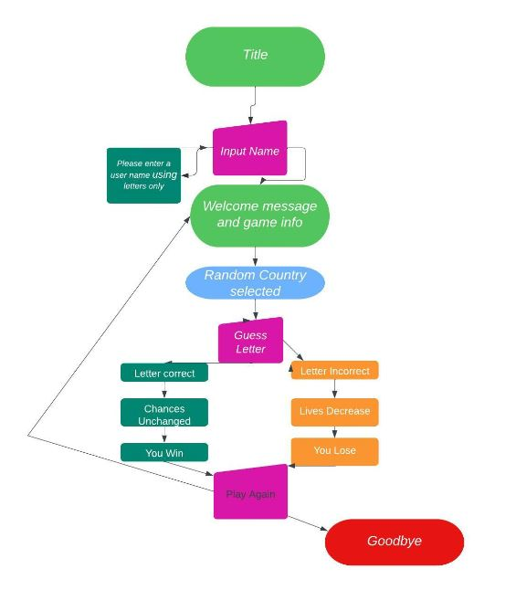

# Destination Unknown...
Destiination Unkown is a simple word guessing game that I created where the word guessed by the player is a country from around the world. The name is a play on the popular song Destination Unknown by Alex Gaudino which I unknowingly kept singing while I was working on this game. Sorry if it is now in your head also!

The game follows the same logic as most guessing word games. The user is told how many chances they have, calculated to be 1.5 times the lenght of the word. Everytime they get a letter right it will show up in the word eg. the user guesses 'a' this then reveals it was a correct guess and shows the word as *a*a*a. If the user guesses wrong then there chances decrease. A list of already guessed letters is shown to the user so that they can try and figure out the country before they run out of lives. 

It is a fun game to play for all ages and is suprisinly hard at times so I really enjoyed making it as my first go at a python based project. 

## How to play
1. The player will be asked to enter their name. 
2. Once they enter a valid name (letters only) the user will be told how many chances they have and how long the country they are looking for is. 
3. The user is asked to submit a guess, the app takes one letter at a time and then they are told if it correct or incorrect. 
4. If the guess is correct the users chances stay the same. If it is incorrect their chances decrease. 
5. If the player's guess is correct then the next time the country will show with the correct letters in the right place so that the user can start to whittle down their guesses. 
6. If the user guesses the country before they run out of chances then they will be congradulated and asked if they woudl like to play again.
7. If the player runs out of chances then they loose and are told what the country was and asked if they would liek to play again. 
8. If the answer is yes the game restarts. If the answer is no then the game ends. 

## Site Owner Goals
- To create an app that would simple an easy to use
- To give the user clear instructions on how to play 
- To provide a clean and logical interface that would have players return to play again
- For the user to have fun and share it with friends

## User Stories
* As a user I want to:
 - Understand how the game works
 - Easily play along with the game with little to no difficulty
 - See how many turns I have left
 - Guess the correct country
 - Play again if I wish to do so

## Logic Flow
In order for me to work throught the logic of how the game would work and what python code I would need to write I created a flow chart using Lucid Chart. It was very beneficial for me to have a flow chart while working on this game as it kept me focused on the task at hand and allow me to build out the basic code to create this site. As new student of python I found this helped me greatly to get a grasp of the task at hand and to break it down into simple code I could write myself.

## Features
#### Title

#### Welcome Message

## Deployment
----------------------Fix  this as GitHub was only used for bits

This site was deployed via GitHub pages using the following steps:
1. Open GitHub and locate the [O Canada Quiz Repository](https://github.com/ciaralynch72/oh_canada_quiz)
2. At the top of the repository, locate the "Settings" button on the menu
2. In the left-hand navigation section scroll down to the **Pages** button
3. From the source section drop-down menu change Branch from **none** to **main** and click the **Save**
4. After several minutes the website will be live and and there will be the link to [live site](https://ciaralynch72.github.io/oh_canada_quiz/)

## Clone Project ##

1. Go to Git Hub
2. Go to [O Canada Quiz Repository](https://github.com/ciaralynch72/oh_canada_quiz)
3. Click on it to go to main repository site
4. Click on the Code drop down button menu next to the greeen Gippod button
5. Click on HTTP section you will see the http of the repository click on the window next to it it will say copied
6. Clikced on Download and Zip
7. Clicked on Open with GitHubDesktop

The site was deployed via [Heroku](https://dashboard.heroku.com/apps), and the live link can be found here: [Word-Py](https://word-py.herokuapp.com/)

Before deploying to Heroku pip3 freeze > requirements.txt was used to add all the dependencies required to the requirements.txt file. This is required for the game to run on Heroku.

The following steps were then taken:
1. Log in to [Heroku](https://dashboard.heroku.com/apps) or create an account.
2. On the main page click the button labelled New in the top right corner and from the drop-down menu select "Create New App".
3. Enter a unique and meaningful app name.
4. Next select your region.
5. Click on the Create App button.
6. Click on the Settings Tab and scroll down to Config Vars.
7. Click Reveal Config Vars and enter PORT into the Key box and 8000 into the Value box and click the Add button.
8. Next, scroll down to the Buildpack section click Add Buildpack select python and click Save Changes
9. Repeat step 11 to add node.js. Note: The Buildpacks must be in the correct order. If not click and drag them to move into the correct order.
10. Scroll to the top of the page and choose the Deploy tab.
11. Select Github as the deployment method.
12. Confirm you want to connect to GitHub.
13. Search for the repository name and click the connect button.
14. Scroll to the bottom of the deploy page and either click Enable Automatic Deploys for automatic deploys or Deploy Branch to deploy manually. I chose automatic for this app. 
15. Click View to view the deployed site.

The site is now live and operational.

## Credits

- #### Copy
The basic copy included in this site was written by the designer. 

- #### Design
Design was inspired from the traditional colors or a globe. 

 - #### Online learning resources
Stackoverflow, YouTube, blogs, and tutorials. I have used the following tutorials as inspiration to create this .

- #### Python tutorials

- #### README.md
I learned alot about how to approach my README file from past projects of Code Institute student which helped me navigate this huge learning curve. Kudos to those who have shared past projects. 

- #### Slack
Code Institute's slack channel was a huge help in helping with problems and to give a sense of what was expected for projects. Support from fellow students was greatly appreciated.

- #### Mentor
My mentor Guido Cecilio was extremely generous with his time and sharing helpful tips with me throughout out mentor sessions. It really helped to know I was on the right track and to have his expertise to learn from. 

- #### Cohort Facilitators
Code Institutes Facilitators were great throughout the project, answering questions and encouraging us to the finish line. They also made it easy to stay on track and keep everyone up to date. Thanks Kenan Wright and Kascia Bogucka.

- #### Cohort Students
Big thanks to my cohort for the positivity and encouragement in the slack group. Knowing everyone was in the same both with the jump in learning in JavaScript made it easier to get through this project. 

- #### Code Institute and MSLETB
Big thank you to Code institute for creating such a great learning platform that gave me the tools and knowledge to create this website and for MSLETB for the opportunity to participate in this course. 

##### Thank You!

